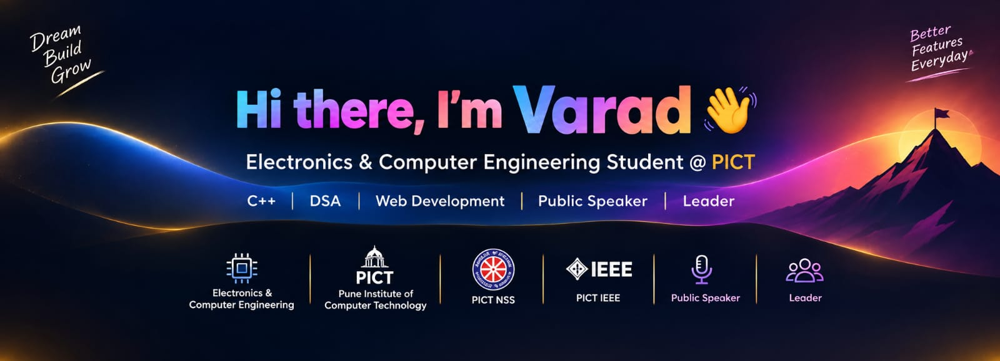

---

# 👋 Varad Vinay Doiphode

### Electronics & Computer Engineering Student @ PICT

---

## 👨‍💻 About Me

| Category             | Details                                                       |
| -------------------- | ------------------------------------------------------------- |
| 🎓 **Education**     | Electronics & Computer Engineering @ **PICT**                 |
| 💡 **Interests**     | Technology, Problem Solving, Engineering & Innovation         |
| 🎤 **Communication** | Public Speaking & Communication                               |
| 👨‍💼 **Leadership** | Leadership, Teamwork & Taking Initiative                      |
| 🎯 **Focus**         | Building technical knowledge and practical engineering skills |

---

## 💻 Technical Skills

| Area                   | Skills                                         |
| ---------------------- | ---------------------------------------------- |
| 🧑‍💻 **Programming**  | C • C++                                        |
| 🧠 **DSA**             | Data Structures • Algorithms • Problem Solving |
| 🌐 **Web Development** | HTML • CSS • JavaScript                        |

---

## 🌟 Activities & Communities

| Organization / Activity | Experience                                                                                                                                                                          |
| ----------------------- | ----------------------------------------------------------------------------------------------------------------------------------------------------------------------------------- |
| 🤖 **PICT Robotics**    | Exploring robotics, participating in technical projects and developing practical engineering skills.                                                                                |
| ⚡ **PICT IEEE**         | Exploring technology, participating in technical activities and connecting with the engineering community.                                                                          |
| 🤝 **PICT NSS**         | Actively participating in various social-service activities through **PICT NSS**, contributing to community initiatives and working with people to create a positive social impact. |

---

## 🚀 Currently Learning

| Learning Area                       | Focus                                                     |
| ----------------------------------- | --------------------------------------------------------- |
| 🧠 **Data Structures & Algorithms** | Improving algorithmic thinking and problem-solving skills |
| 🤖 **Robotics**                     | Exploring robotics and practical engineering applications |
| 🌐 **Web Development**              | Building knowledge of frontend technologies               |
| 🎤 **Public Speaking**              | Improving communication and presentation skills           |
| 👨‍💼 **Leadership & Teamwork**     | Developing collaboration and leadership abilities         |

---

## 🎯 Career Goal

| Goal                                                                                                          |
| ------------------------------------------------------------------------------------------------------------- |
| 🚀 **Learn • Build • Lead • Create an Impact**                                                                |
| Grow as an engineer by developing strong **technical, problem-solving, communication and leadership skills**. |

---

## 📊 GitHub Statistics

| GitHub Profile                                                                                                                                  | Most Used Languages                                                                                                                                       |
| ----------------------------------------------------------------------------------------------------------------------------------------------- | --------------------------------------------------------------------------------------------------------------------------------------------------------- |
|  |  |

---

## 🔥 GitHub Streak

| Contribution Streak                                                                                                            |
| ------------------------------------------------------------------------------------------------------------------------------ |
| 

 |

---

## 📫 Connect With Me

| Platform        | Link                                                                                                                                                                                 |
| --------------- | ------------------------------------------------------------------------------------------------------------------------------------------------------------------------------------ |
| 🐙 **GitHub**   |                          |
| 💼 **LinkedIn** |  |

---

## ⭐ Profile

|                      |                                              |
| -------------------- | -------------------------------------------- |
| 🌱 **Learning**      | Always learning something new                |
| 🛠️ **Building**     | Turning knowledge into practical projects    |
| 🤝 **Collaborating** | Learning and growing with others             |
| 🚀 **Mindset**       | Keep Learning • Keep Building • Keep Leading |

---

### ⭐ Thanks for visiting my profile!

**Keep Learning • Keep Building • Keep Leading 🚀**

